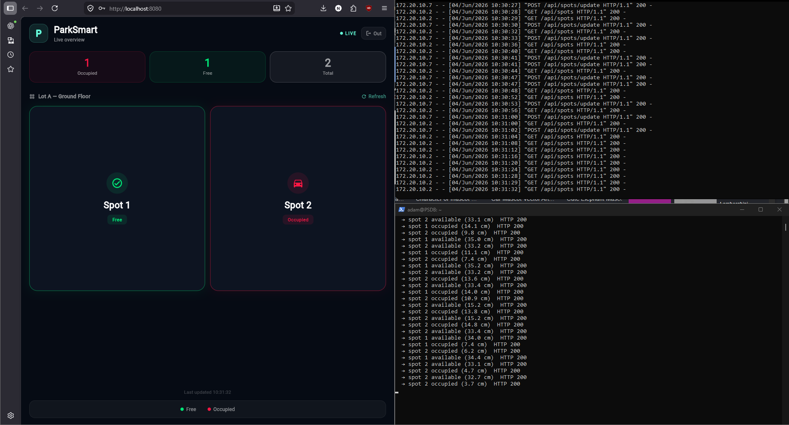
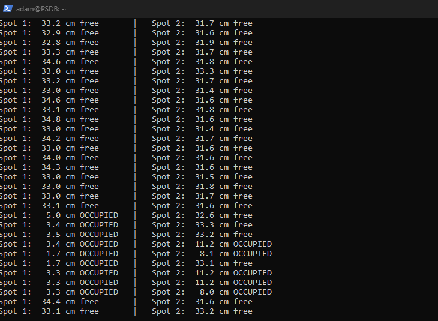
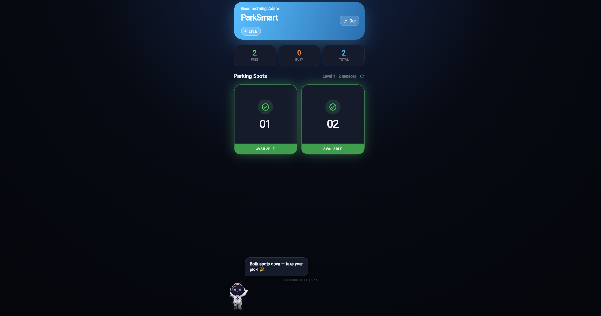

# ParkSmart 🅿️

Smart parking detection system — an end-to-end IoT project: ultrasonic sensors on a Raspberry Pi detect whether parking spots are occupied, a Flask REST API tracks state, and a Flutter app shows live availability.

Built as my Final Year Project at Ruppin Technological College.

## How it works

```
HC-SR04 sensors ──GPIO──▶ Raspberry Pi Zero W ──HTTP POST──▶ Flask API + SQLite ──REST──▶ Flutter app
```

- Each parking spot has an **HC-SR04 ultrasonic sensor** wired to the Pi's GPIO. A polling script measures distance from echo timing; a reading below the threshold means a car is present.
- The script POSTs **only on state transitions** (free ⇄ occupied), keeping traffic minimal.
- The **Flask backend** (SQLAlchemy on SQLite) stores users, lots, spots, sensor data, and reservations across a normalized 5-table schema, with JWT-based auth.
- The **Flutter app** polls the REST API and renders live spot status, with login and a friendly mascot that comments on lot availability.
- An **IR-triggered servo gate** controller handles entry barrier automation.

## Live demo

The full stack running end-to-end — Flutter web dashboard (left), Flask API access log (top right), and live sensor readings from the Pi (bottom right). A hand in front of Sensor 2 flips Spot 2 to "Occupied" in real time:



Real sensor output — both sensors polling, occupancy flipping as objects move in and out of range:



The app dashboard:



## Structure

| Folder | Contents |
|---|---|
| `backend/` | Flask REST API + SQLite — runs on the Raspberry Pi |
| `app/` | Flutter app (mobile + web) |
| `hardware/` | Python sensor polling, servo gate control, GPIO tests |

## Stack

- **Sensing:** HC-SR04 ultrasonic sensors + IR sensor + servo gate, Raspberry Pi Zero W (GPIO)
- **Backend:** Python 3 · Flask · SQLAlchemy · SQLite · JWT auth
- **App:** Flutter (Dart), Provider state management
- **Comms:** HTTP REST over local network; Pi operated headless over SSH

## Quick start (backend)

```bash
cd backend
pip install -r requirements.txt
py run.py
```

API runs at `http://localhost:5000/api`. Set `SECRET_KEY` in the environment for anything beyond local development.

## Hardware notes

Sensor polling runs on the Pi (`hardware/sensor_polling.py`): it triggers the HC-SR04, computes distance from echo timing, debounces readings, and POSTs a JSON state change to the backend when a spot's occupancy flips. `hardware/gate_control.py` opens a servo-driven gate when the IR sensor detects an approaching car.
